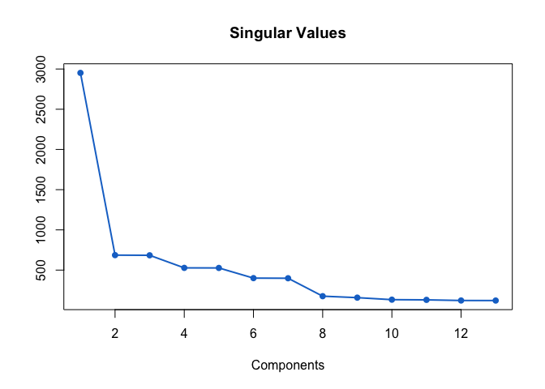
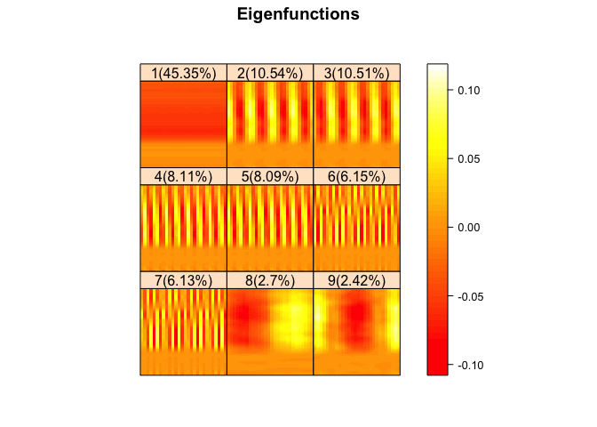
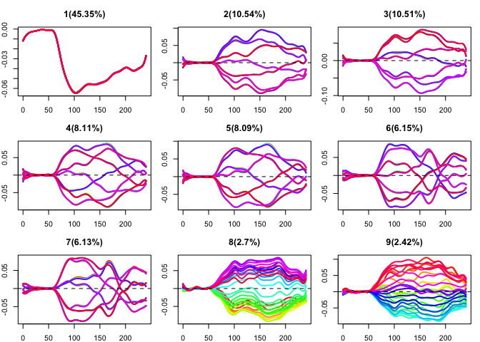
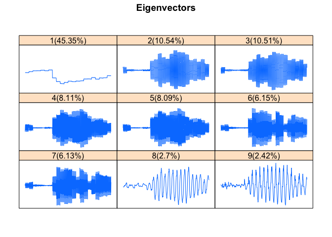
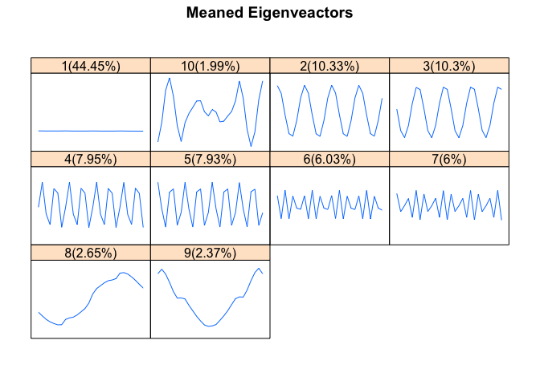
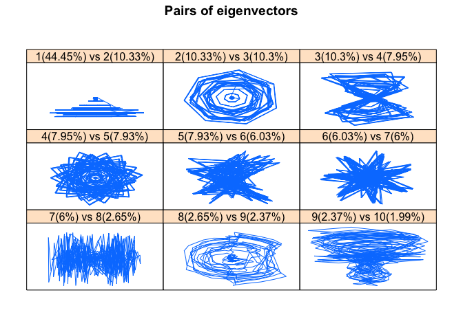
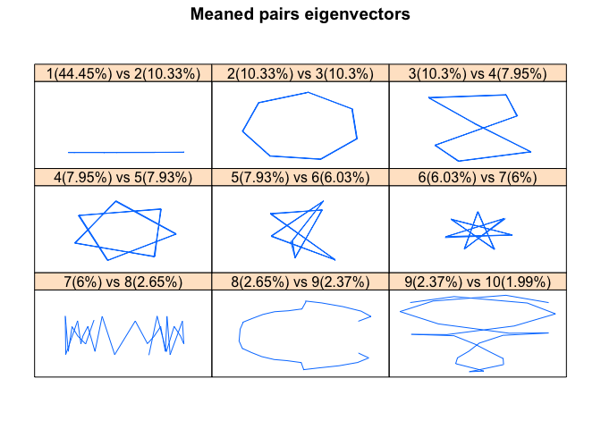
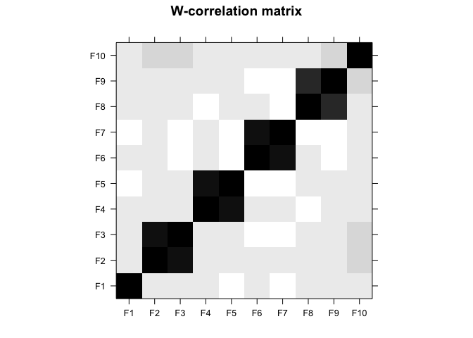
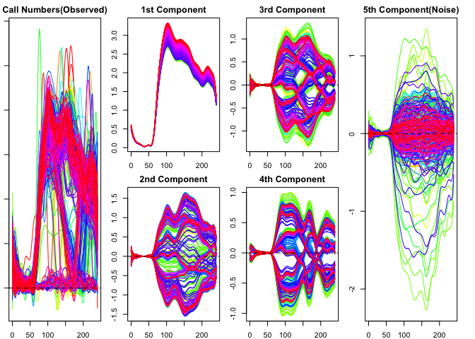
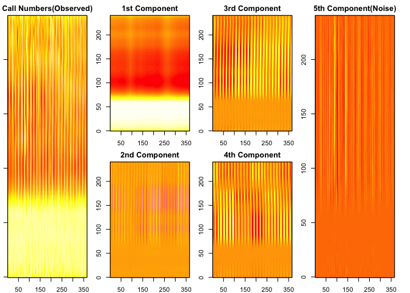

<!-- README.md is generated from README.Rmd. Please edit that file -->
Rfssa
=====

The Rfssa package provides the collections of necessary functions to implement Functional Singular Spectrum Analysis (FSSA) for analysing Functional Time Series (FTS). FSSA is a novel non-parametric method to perform decomposition and reconstruction of FTS.

Intruction
==========

Typically the use of the package starts with the decomposition of the functional time series using fssa. Then, a suitable grouping of the elementary time series is required. This can be done heuristically, for example, via looking at the plots of the decomposition (plot). Alternatively, one can examine the so-called w-correlation matrix (fwcor). Next step includes the reconstruction of the time-series using the selected grouping (freconstruct).

Typically the use of the package starts with the decomposition of the functional time series using fssa. Then, a suitable grouping of the elementary time series is required. This can be done heuristically, for example, via looking at the plots of the decomposition (plot). Alternatively, one can examine the so-called w-correlation matrix (fwcor). Next step includes the reconstruction of the time-series using the selected grouping (freconstruct).

Installation
------------

You can install Rfssa from github with:

``` r
# install.packages("devtools")
devtools::install_github("haghbinh/Rfssa/")
```

Example
-------

This is a basic example which shows you how to use fssa algorithm for functional time series:

``` r
## basic example code
## Call Center Data
data("Callcenter")
library(fda)
#> Loading required package: splines
#> Loading required package: Matrix
#> 
#> Attaching package: 'fda'
#> The following object is masked from 'package:graphics':
#> 
#>     matplot
library(Rfssa)
D <- matrix(sqrt(Callcenter$calls),nrow = 240)
N <- ncol(D)
time <- 1:N
K <- nrow(D)
u <- seq(0,K,length.out =K)
d <- 22 #Optimal Number of basises
basis <- create.bspline.basis(c(min(u),max(u)),d)
Ysmooth <- smooth.basis(u,D,basis)
Y <- Ysmooth$fd
## fssa decomposition
L <- 28
U <- fssa(Y,L)
plot(U,d=13)
```



``` r
plot(U,d=9,type="efunctions")
```



``` r
plot(U,d=9,type="efunctions2")
```



``` r
plot(U,d=9,type="vectors")
```



``` r
plot(U,d=10,type="meanvectors")
```



``` r
plot(U,d=10,type="paired")
```



``` r
plot(U,d=10,type="meanpaired")
```



``` r
plot(U,d=10,type="wcor")
```



``` r
## fssa reconstruction
gr <- list(1,2:3,4:5,6:7,8:20)
Q <- freconstruct(U, gr)

cols3 <- rainbow(N)

layout(matrix(c(1,1,2,3,4,5,6,6),nr=2))
par(mar=c(2,1,2,2))
plot(Y,lty=1,xlab="",main="Call Numbers(Observed)"
    ,ylab="",col=cols3)
#> [1] "done"
    plot(Q[[1]],lty=1,xlab="",main="1st Component"
    ,ylab="",lwd=1,col=cols3)
#> [1] "done"
    plot(Q[[2]],lty=1,xlab="",main="2nd Component"
    ,ylab="",lwd=1,col=cols3)
#> [1] "done"
    plot(Q[[3]],lty=1,xlab="",main="3rd Component"
    ,ylab="",lwd=1,col=cols3)
#> [1] "done"
    plot(Q[[4]],lty=1,xlab="",main="4th Component"
    ,ylab="",lwd=1,col=cols3)
#> [1] "done"
    plot(Q[[5]],lty=1,xlab="",main="5th Component(Noise)"
    ,ylab="",lwd=1,col=cols3)
```



    #> [1] "done"


    layout(matrix(c(1,1,2,3,4,5,6,6),nr=2))
    par(mar=c(2,1,2,2))
    ftsplot(u,time,Y,space = 0.2,type=3,ylab = "",xlab = "Day",main = "Call Numbers(Observed)")
    ftsplot(u,time,Q[[1]],space = 0.2,type=3,ylab = "",xlab = "Day",main = "1st Component")
    ftsplot(u,time,Q[[2]],space = 0.2,type=3,ylab = "",xlab = "Day",main = "2nd Component")
    ftsplot(u,time,Q[[3]],space = 0.2,type=3,ylab = "",xlab = "Day",main = "3rd Component")
    ftsplot(u,time,Q[[4]],space = 0.2,type=3,ylab = "",xlab = "Day",main = "4th Component")
    ftsplot(u,time,Q[[5]],space = 0.2,type=3,ylab = "",xlab = "Day",main = "5th Component(Noise)")


